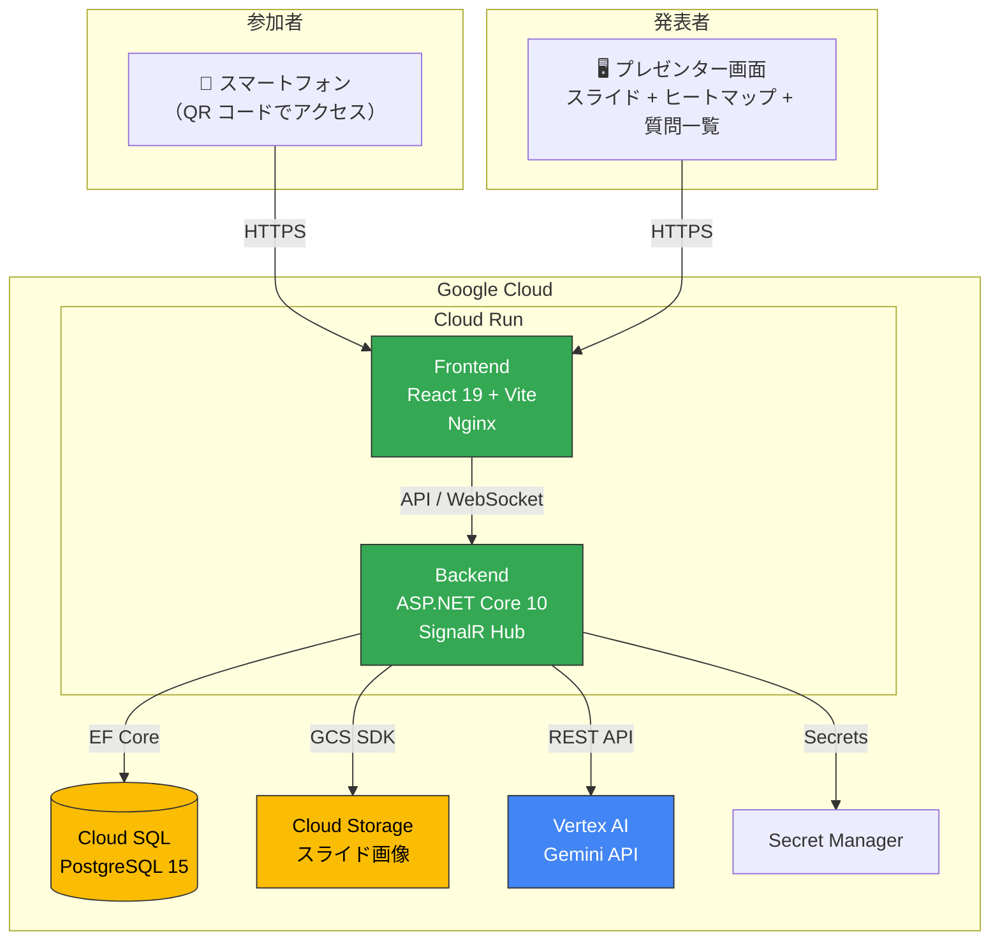

```mermaid
graph TB
    subgraph "参加者"
        A["📱 スマートフォン<br>（QR コードでアクセス）"]
    end

    subgraph "発表者"
        B["🖥️ プレゼンター画面<br>スライド + ヒートマップ + 質問一覧"]
    end

    subgraph "Google Cloud"
        subgraph "Cloud Run"
            C[Frontend<br>React 19 + Vite<br>Nginx]
            D[Backend<br>ASP.NET Core 10<br>SignalR Hub]
        end
        E[(Cloud SQL<br>PostgreSQL 15)]
        F[Cloud Storage<br>スライド画像]
        G[Vertex AI<br>Gemini API]
        H[Secret Manager]
    end

    A -- "HTTPS" --> C
    B -- "HTTPS" --> C
    C -- "API / WebSocket" --> D
    D -- "EF Core" --> E
    D -- "GCS SDK" --> F
    D -- "REST API" --> G
    D -- "Secrets" --> H

    style G fill:#4285F4,stroke:#333,color:#fff
    style C fill:#34A853,stroke:#333,color:#fff
    style D fill:#34A853,stroke:#333,color:#fff
    style E fill:#FBBC04,stroke:#333,color:#000
    style F fill:#FBBC04,stroke:#333,color:#000
```
