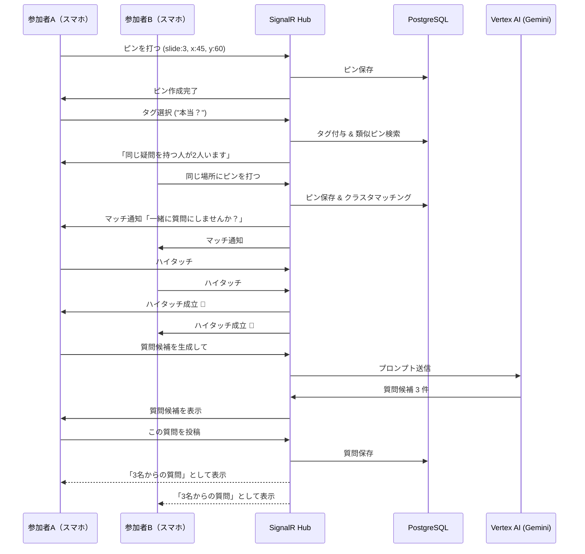

```mermaid
sequenceDiagram
    participant U1 as 参加者A（スマホ）
    participant U2 as 参加者B（スマホ）
    participant Hub as SignalR Hub
    participant DB as PostgreSQL
    participant AI as Vertex AI (Gemini)

    U1->>Hub: ピンを打つ (slide:3, x:45, y:60)
    Hub->>DB: ピン保存
    Hub->>U1: ピン作成完了

    U1->>Hub: タグ選択 ("本当？")
    Hub->>DB: タグ付与 & 類似ピン検索
    Hub->>U1: 「同じ疑問を持つ人が2人います」

    U2->>Hub: 同じ場所にピンを打つ
    Hub->>DB: ピン保存 & クラスタマッチング
    Hub->>U1: マッチ通知「一緒に質問にしませんか？」
    Hub->>U2: マッチ通知

    U1->>Hub: ハイタッチ
    U2->>Hub: ハイタッチ
    Hub->>U1: ハイタッチ成立 🎉
    Hub->>U2: ハイタッチ成立 🎉

    U1->>Hub: 質問候補を生成して
    Hub->>AI: プロンプト送信
    AI->>Hub: 質問候補 3 件
    Hub->>U1: 質問候補を表示

    U1->>Hub: この質問を投稿
    Hub->>DB: 質問保存
    Hub-->>U1: 「3名からの質問」として表示
    Hub-->>U2: 「3名からの質問」として表示
```
